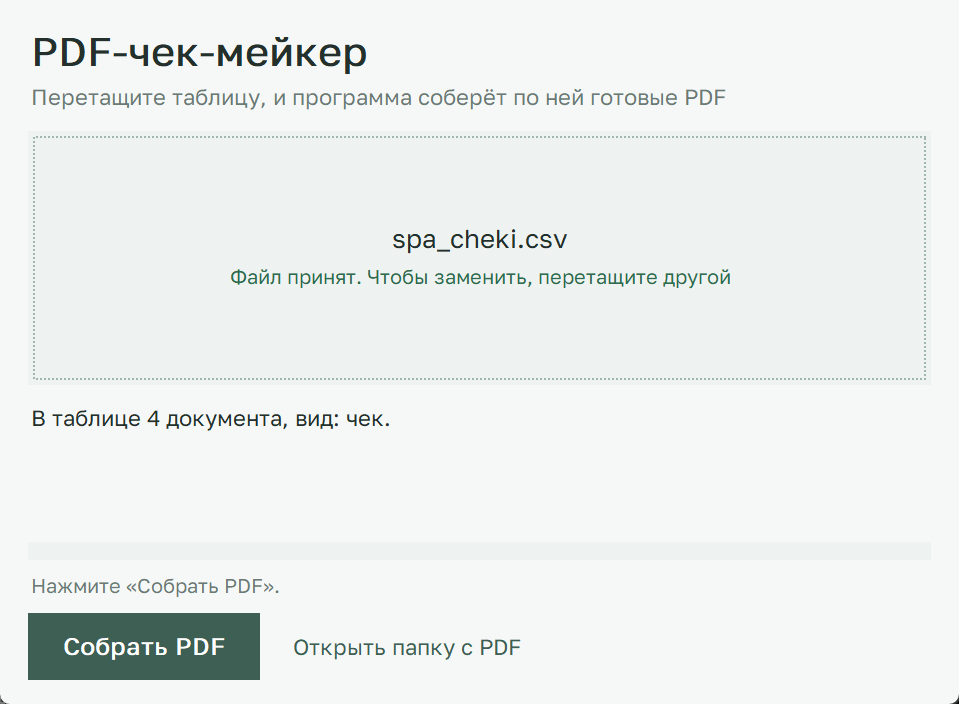
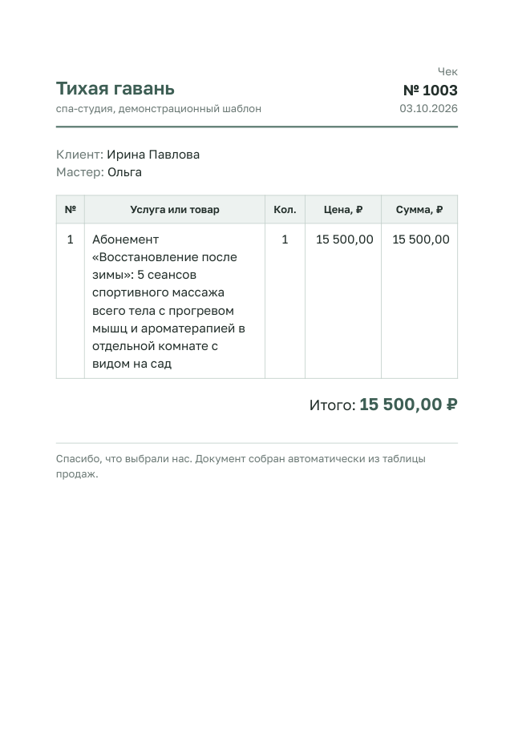
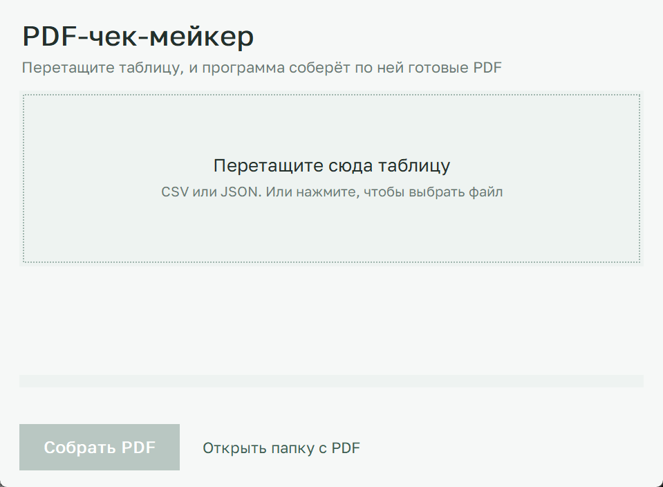
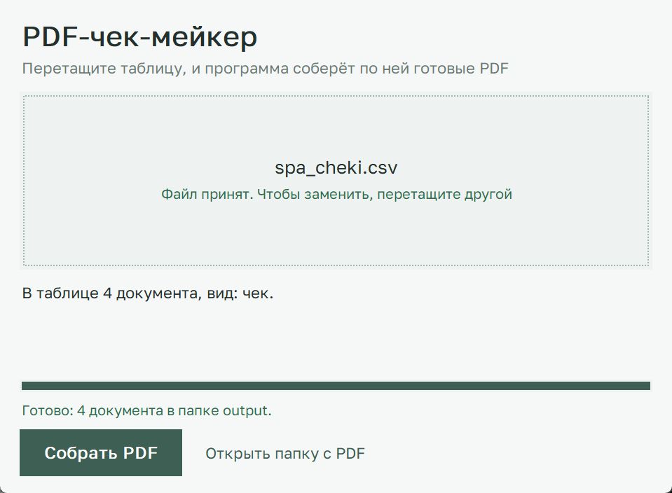

# PDF-чек-мейкер

Программа превращает таблицу в готовые PDF-документы. Вы перетаскиваете в окно таблицу
с продажами, нажимаете одну кнопку, и по каждой строке получаете чек или подарочный сертификат,
готовый к печати и отправке клиенту. Суммы программа считает сама.



Так выглядит результат:

 

## Установка (Windows, один раз)

1. **Скачайте программу.** На этой странице нажмите зелёную кнопку **Code**, потом **Download ZIP**.
   Распакуйте архив в любую папку, например на Рабочий стол.
2. **Поставьте Python**, если его ещё нет. Скачайте с [python.org/downloads](https://www.python.org/downloads/).
   В первом окне установщика поставьте галочку **Add python.exe to PATH**, иначе программа его не найдёт.
3. **Поставьте GTK3 Runtime.** Это движок, который рисует буквы в PDF.
   Откройте [страницу загрузки](https://github.com/tschoonj/GTK-for-Windows-Runtime-Environment-Installer/releases),
   скачайте файл `gtk3-runtime-…-win64.exe` и везде нажимайте **Next**.
   Если Windows покажет синее окно «Защитила компьютер», нажмите «Подробнее» и «Выполнить в любом случае».
4. **Дважды щёлкните по `ustanovka.bat`** в папке программы. Он сам скачает нужные библиотеки
   и напишет «Готово». Нужен интернет, займёт около минуты.

## Как работать

1. Дважды щёлкните по **`zapusk.bat`**. Откроется окно:

   

2. **Перетащите таблицу в рамку.** Если перетаскивать неудобно, нажмите на рамку и выберите файл.
   Для пробы возьмите готовые таблицы из папки `data`.
3. Программа проверит таблицу и напишет, сколько в ней документов и какой это вид: чек или сертификат.
4. Нажмите **«Собрать PDF»**. Полоска покажет, как идёт работа.
   Когда всё готово, откроется папка `output` с PDF-файлами.

   

Кнопка «Открыть папку с PDF» открывает ту же папку в любой момент.

## Своя таблица

Таблицу удобно вести в Excel. Чтобы программа её прочитала, сохраните её через
**Файл → Сохранить как → CSV (разделители — запятые)** или **CSV UTF-8**. Подходят оба варианта.
Названия колонок в первой строке пишите латиницей, как в таблицах ниже.

**Чек** (пример: `data/spa_cheki.csv`). Одна строка — одна услуга или товар.
Строки с одинаковым номером программа соберёт в один чек.

| Колонка | Что писать | Пример |
|---|---|---|
| `invoice_id` | номер чека | 1001 |
| `date` | дата | 02.10.2026 |
| `customer_name` | имя клиента | Анна Смирнова |
| `master` | мастер, можно оставить пустым | Ольга |
| `product` | услуга или товар | Массаж спины 60 минут |
| `qty` | количество, пусто = 1 | 1 |
| `price` | цена за одну штуку | 3200 |

**Подарочный сертификат** (пример: `data/sertifikaty.json`). Одна строка — один сертификат.

| Колонка | Что писать | Пример |
|---|---|---|
| `invoice_id` | номер сертификата | S-201 |
| `date` | дата выдачи | 01.10.2026 |
| `recipient` | кому | Дарья Волкова |
| `from_whom` | от кого, можно оставить пустым | от мамы |
| `service` | услуга или «на сумму» | Массаж всего тела 90 минут |
| `amount` | номинал | 9000 |
| `valid_until` | действует до | 01.04.2027 |

## Если что-то не так

| Программа пишет | Что сделать |
|---|---|
| «Программа ещё не установлена» | Запустите `ustanovka.bat`, потом снова `zapusk.bat` |
| «Не найден GTK» | Поставьте GTK3 Runtime (шаг 3 установки) |
| «Это не таблица» | Сохраните таблицу из Excel в формате CSV |
| «Ни один образец не подходит» | Проверьте названия колонок в первой строке, они должны совпадать с таблицами выше |
| «Файл открыт в другой программе» | Закройте этот PDF в просмотрщике и нажмите «Собрать PDF» ещё раз |

## Для разработчика

Консольная версия с меню (её просит домашнее задание):

```
venv\Scripts\python pdf_generator.py
```

На macOS: `brew install pango`, затем `python3 -m venv venv`, `source venv/bin/activate`,
`pip install -r requirements.txt`, `python okno.py`.

Новый вид документа: положите HTML-шаблон в `templates/`, поля из таблицы подставляются как `{{ имя_колонки }}`,
позиции чека перебираются через ``. Окно само поймёт, к каким таблицам подходит шаблон.

| Файл | Что внутри |
|---|---|
| `okno.py` | окно с перетаскиванием |
| `pdf_generator.py` | чтение таблиц, подсчёт сумм, сборка PDF, консольное меню |
| `templates/` | образцы чека и сертификата |
| `data/` | тестовые таблицы |
| `primery/` | два готовых PDF |
| `PROMPT.md` | промпт, по которому собран проект |
| `OFFER.md` | описание услуги для фриланс-биржи |

Спа-студия «Тихая гавань» и все имена в примерах выдуманы.
